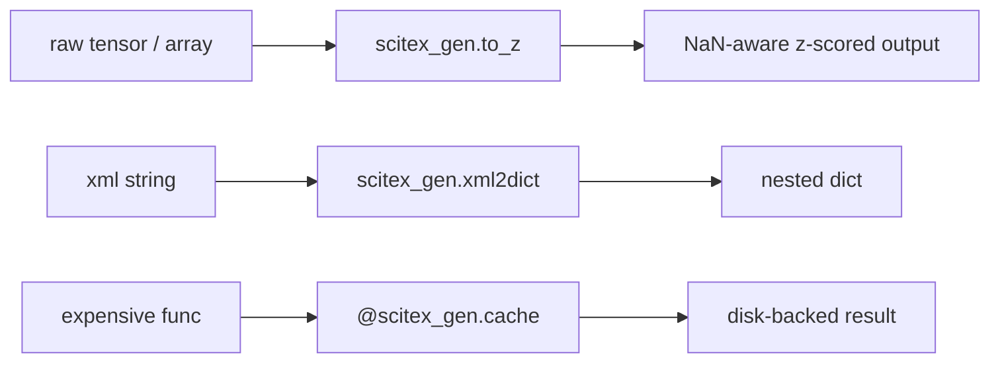

# SciTeX Gen (<code>scitex-gen</code>)

<p align="center">
  <a href="https://scitex.ai">
    
  </a>
</p>

<p align="center"><b>General-purpose Python utilities for scientific workflows</b></p>

<p align="center">
  <a href="https://scitex-gen.readthedocs.io/">Full Documentation</a> · <code>uv pip install scitex-gen[all]</code>
</p>

<!-- scitex-badges:start -->
<p align="center">
  <a href="https://pypi.org/project/scitex-gen/"></a>
  <a href="https://pypi.org/project/scitex-gen/"></a>
  <a href="https://github.com/ywatanabe1989/scitex-gen/actions/workflows/rtd-sphinx-build-on-ubuntu-latest.yml"></a>
</p>
<p align="center">
  <a href="https://github.com/ywatanabe1989/scitex-gen/actions/workflows/pytest-matrix-on-ubuntu-py3-11-3-12-3-13.yml"></a>
  <a href="https://github.com/ywatanabe1989/scitex-gen/actions/workflows/install-test.yml"></a>
  <a href="https://codecov.io/gh/ywatanabe1989/scitex-gen"></a>
</p>
<!-- scitex-badges:end -->

---

`scitex-gen` collects miscellaneous helpers that have been useful across many
SciTeX projects: caching, normalization, environment detection, mat→npy
conversion, xml→dict parsing, a `TimeStamper`, dimension wranglers, and more.

## Problem and Solution

| # | Problem | Solution |
|---|---------|----------|
| 1 | **One-off utilities scatter across scripts** -- every research repo grows its own `to_even`, `xml2dict`, `TimeStamper`, NaN-aware z-score | **Curated misc bag** -- `scitex_gen.cache / to_z / to_nanz / xml2dict / TimeStamper / transpose / to_even / to_odd` collected in one importable place |
| 2 | **Environment detection ad-hoc** -- "am I in a notebook? a script? interactive?" answered three different ways across projects | **`scitex_gen.detect_environment` / `is_notebook` / `is_script`** -- single canonical detector used across SciTeX peers |
| 3 | **Legacy `scitex.gen` surface unstable** -- helpers migrated to canonical peers (`scitex_stats`, `scitex_os`, `scitex_str`, ...) but old import paths still in use | **Backward-compatible re-exports + DeprecationWarning** -- `scitex_gen.check_host` etc. still work, point to the new home, and warn at import time |

## Installation

Requires Python >= 3.10.

```bash
pip install scitex-gen
```

### Configuration

Copy [`.env.example`](./.env.example) to `.env` (or source it from your
shell) to override defaults such as `SCITEX_DIR`.

## Architecture

```
scitex_gen/
├── _fs/                  ← filesystem helpers (symlink, src, title2path, print_config)
├── _introspect/          ← introspection, caching, DimHandler, list_packages, mat2py, xml2dict
├── _ipython/             ← IPython/Jupyter helpers (notebook detection, embed, paste, less)
├── _legacy/              ← backward-compat wrappers (TimeStamper, deprecated start/close)
├── _numeric/             ← math/numerics (norm, norm_cache, symlog, to_even, to_odd, to_rank, transpose)
├── _skills/              ← agent-facing skill pages
├── misc.py               ← connect_nums, float_linspace
├── path.py               ← placeholder (path management lives in scitex-path)
├── _type.py / _var_info.py   ← type annotations (optional, requires xarray)
└── _wrap.py              ← text wrapping utility
```

Tiny single-purpose modules organized by domain. Most are pure Python;
`to_z` and the geometric-median variants opt into `torch` when available.
Several functions are re-exported from peer packages (`scitex-context`,
`scitex-os`, `scitex-sh`, etc.) for backward compatibility.

## 1 Interfaces

<details open>
<summary><strong>Python API</strong></summary>

<br>

```python
import scitex_gen

scitex_gen.cache(...)
scitex_gen.TimeStamper()
scitex_gen.detect_environment()
scitex_gen.xml2dict(...)
scitex_gen.to_z(...)
scitex_gen.to_even(7)     # 6
scitex_gen.to_odd(8)      # 7
scitex_gen.transpose(...)
scitex_gen.list_packages()
```

> **[Full API reference](https://scitex-gen.readthedocs.io/en/latest/api/scitex_gen.html)**

</details>

## Demo



```python
>>> import scitex_gen as gen
>>> gen.to_even(7)
6
>>> gen.to_odd(8)
7
>>> ts = gen.TimeStamper(); ts("step1")  # logs elapsed
```

## Quick Start

```python
import scitex_gen as gen

gen.cache(...)
gen.TimeStamper()
gen.xml2dict(...)
gen.to_z(tensor)          # requires torch
gen.to_even(n)
gen.to_odd(n)
gen.transpose(...)
```

## Status

Standalone fork of `scitex.gen`. The umbrella package's `scitex.gen` import
path is preserved via a `sys.modules`-alias bridge.

Decoupling notes:
- `scitex.{decorators,str,os,introspect,session,context,sh,dict}` →
  `scitex_*` direct imports (peer packages).
- `scitex.torch.nanstd` → optional via `try/except` with a torch-only
  fallback (only matters for `_norm.to_z / to_nanz`).
- `import scitex` removed from `_less.py` (was unused in module body).
- self-references in `_norm_cache.py` rewritten to `scitex_gen.*`.

## Part of SciTeX

`scitex-gen` is part of [**SciTeX**](https://scitex.ai). Install via the
umbrella with `pip install scitex[gen]` to use as `scitex.gen` (Python).

The SciTeX system follows the Four Freedoms for Research below, inspired by [the Free Software Definition](https://www.gnu.org/philosophy/free-sw.en.html):

>Four Freedoms for Research
>
>0. The freedom to **run** your research anywhere — your machine, your terms.
>1. The freedom to **study** how every step works — from raw data to final manuscript.
>2. The freedom to **redistribute** your workflows, not just your papers.
>3. The freedom to **modify** any module and share improvements with the community.
>
>AGPL-3.0 — because we believe research infrastructure deserves the same freedoms as the software it runs on.

## License

AGPL-3.0-only (see [LICENSE](./LICENSE)).

---

<p align="center">
  <a href="https://scitex.ai" target="_blank"></a>
</p>

<!-- EOF -->
